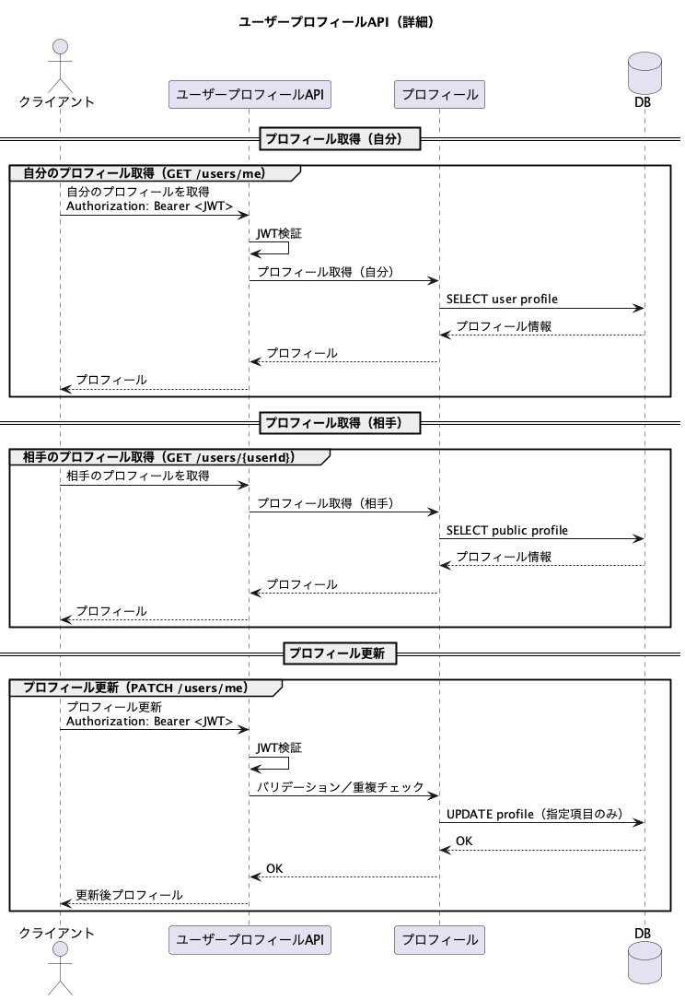

# ユーザープロフィールに関するAPI




---
## 概要

```txt
ユーザープロフィールに関するAPI。

ユーザーのプロフィール情報を取得し、
ログイン中ユーザーのニックネームおよびアバター画像を更新する。
```

<br>

## 機能
#### ユーザー情報
- [自分のプロフィール情報を取得するもの](#自分のプロフィール情報を取得するもの)
- [相手のプロフィール情報を取得するもの](#相手のプロフィール情報を取得するもの)

- [自分のプロフィールを更新するもの](#自分のプロフィールを更新するもの)
<br>

## 詳細

### 自分のプロフィール情報を取得するもの
**メソッド : GET** <br>
**エンドポイント : /users/me** <br>
<br>

**認証** <br>
Authorizationヘッダに JWT を指定する。
```http
Authorization: Bearer <JWT>
```

**引数** 

なし

**戻り値**

|番号|型|説明|
|:--|:--|:--|
|01|int|ユーザーid|
|02|string|name|
|03|string|nickname|
|04|string \| null|pictureURL|

<br>

---

### レスポンス例
```json
{
  "id": 1,
  "name": "nisi",
  "nickname": "にし",
  "pictureURL": "https://example.com/avatar.png"
}
```
---
<br>

### 相手のプロフィール情報を取得するもの
**メソッド : GET** <br>
**エンドポイント : /users/{userId}** <br>
<br>

**認証** <br>
なし

**引数** 

|番号|名称|型|説明|
|:--|:--|:--|:--|
|01|id|int|取得対象のユーザーid|


**戻り値**

|番号|型|説明|
|:--|:--|:--|
|01|int|ユーザーid|
|02|string|name|
|03|string|nickname|
|04|string \| null|pictureURL|

<br>

---

### レスポンス例
```json
{
  "id": 1,
  "name": "nisi",
  "nickname": "にし",
  "pictureURL": "https://example.com/avatar.png"
}
```
---
<br>

### 自分のプロフィールを更新するもの
**メソッド : PATCH** <br>
**エンドポイント : /users/me** <br>
<br>

**認証** <br>
Authorization ヘッダに JWT を指定する。
```http
Authorization: Bearer <JWT>
```
<br>

**引数** 

|番号|名称|型|説明|
|:--|:--|:--|:--|
|01|nickname|string|変更後のニックネーム|
|02|pictureURL|string|プロフィール画像|

※ 指定された項目のみ更新

**戻り値**

|番号|型|説明|
|:--|:--|:--|
|01|int|ユーザーid|
|02|string|name|
|03|string|nickname|
|04|string|アバター画像のURL|
|05|Datetime|updatedAt|


<br>

---

### レスポンス例
```json
{
  "id": 1,
  "name": "nisi",
  "nickname": "nisi",
  "pictureURL": "https://example.com/avatar.png",
  "updatedAt": " "
}
```