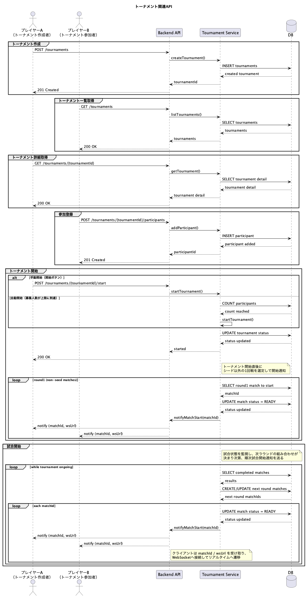

# トーナメント関連API




---
## 概要

```txt
トーナメントの作成・参加・開始・進行管理に関するAPI。

トーナメント開始後は、サーバが試合の開始タイミングを制御し、
参加者へ試合開始通知（matchId / wsUrl）を送信する。
```

<br>

## 機能
#### トーナメント
- [トーナメントを作成するもの](#トーナメントを作成するもの)
- [トーナメント一覧を取得するもの](#トーナメント一覧を取得するもの)
- [トーナメント詳細を取得するもの](#トーナメント詳細を取得するもの)
- [トーナメントに参加登録するもの](#トーナメントに参加登録するもの)
- [トーナメントを開始するもの（手動）](#トーナメントを開始するもの手動)
- [トーナメントを開始するもの（自動）](#トーナメントを開始するもの自動)
<br>

## 詳細

### トーナメントを作成するもの
**メソッド : POST** <br>
**エンドポイント : /tournaments** <br>
<br>

**認証** <br>
Authorization ヘッダに JWT を指定する。
```http
Authorization: Bearer <JWT>
```

**引数**

|番号|名称|型|説明|
|:--|:--|:--|:--|
|01|name|string|トーナメント名|
|02|maxPlayers|int|募集人数の上限|
|03|rule|string|ルール（任意）|

**戻り値**

|番号|型|説明|
|:--|:--|:--|
|01|string|tournamentId|
|02|string|status|
|03|Datetime|createdAt|

<br>

---

### レスポンス例
```json
{
  "tournamentId": "t-001",
  "status": "waiting",
  "createdAt": "2026-01-15T10:00:00Z"
}
```
---
<br>

### トーナメント一覧を取得するもの
**メソッド : GET** <br>
**エンドポイント : /tournaments** <br>
<br>

**認証** <br>
Authorization ヘッダに JWT を指定する。

**引数**

なし

**戻り値**

|番号|型|説明|
|:--|:--|:--|
|01|array|トーナメント一覧|

<br>

---

### レスポンス例
```json
[
  {
    "tournamentId": "t-001",
    "name": "Winter Cup",
    "status": "waiting",
    "maxPlayers": 8
  },
  {
    "tournamentId": "t-002",
    "name": "Spring Cup",
    "status": "running",
    "maxPlayers": 16
  }
]
```
---
<br>

### トーナメント詳細を取得するもの
**メソッド : GET** <br>
**エンドポイント : /tournaments/{tournamentId}** <br>
<br>

**認証** <br>
Authorization ヘッダに JWT を指定する。

**引数**

|番号|名称|型|説明|
|:--|:--|:--|:--|
|01|tournamentId|string|対象トーナメントID|

**戻り値**

|番号|型|説明|
|:--|:--|:--|
|01|string|tournamentId|
|02|string|name|
|03|string|status|
|04|int|maxPlayers|
|05|array|participants|

<br>

---

### レスポンス例
```json
{
  "tournamentId": "t-001",
  "name": "Winter Cup",
  "status": "running",
  "maxPlayers": 8,
  "participants": [
    {"id": "p1", "name": "Player A"},
    {"id": "p2", "name": "Player B"}
  ]
}
```
---
<br>

### トーナメントに参加登録するもの
**メソッド : POST** <br>
**エンドポイント : /tournaments/{tournamentId}/participants** <br>
<br>

**認証** <br>
Authorization ヘッダに JWT を指定する。

**引数**

|番号|名称|型|説明|
|:--|:--|:--|:--|
|01|tournamentId|string|対象トーナメントID|

**戻り値**

|番号|型|説明|
|:--|:--|:--|
|01|string|participantId|
|02|string|status|

<br>

---

### レスポンス例
```json
{
  "participantId": "p1",
  "status": "registered"
}
```
---
<br>

### トーナメントを開始するもの（手動）
**メソッド : POST** <br>
**エンドポイント : /tournaments/{tournamentId}/start** <br>
<br>

**認証** <br>
Authorization ヘッダに JWT を指定する。

**引数**

|番号|名称|型|説明|
|:--|:--|:--|:--|
|01|tournamentId|string|対象トーナメントID|

**戻り値**

|番号|型|説明|
|:--|:--|:--|
|01|string|status|
|02|Datetime|startedAt|

<br>

**備考** <br>
トーナメント開始後、サーバが1回戦（シード以外）を選定し、
参加者へ試合開始通知（matchId / wsUrl）を送信する。

<br>

---

### レスポンス例
```json
{
  "status": "running",
  "startedAt": "2026-01-15T10:05:00Z"
}
```
---
<br>

### トーナメントを開始するもの（自動）
**メソッド : -** <br>
**エンドポイント : -** <br>
<br>

**概要** <br>
募集人数が上限に到達した時点で、サーバが自動的に開始する。<br>
APIリクエストは不要で、開始後の挙動は手動開始と同様。
