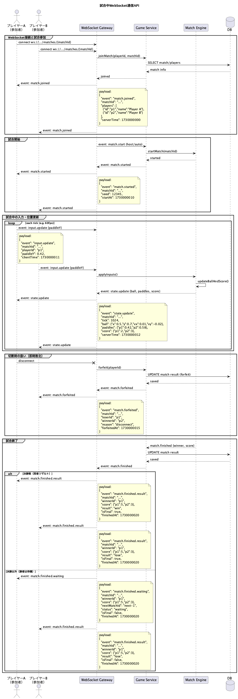

# 試合中WebSocket通信API




---
## 概要

```txt
試合中のリアルタイム通信（入力送信・状態配信・結果通知）を行う。

クライアントはパドル位置のみ送信し、
サーバが当たり判定・得点計算・ボール位置を計算して配信する。
```

<br>

## 機能
#### WebSocket接続
- [接続するもの](#接続するもの)

#### クライアント -> サーバ
- [入力更新を送信するもの](#入力更新を送信するもの)

#### サーバ -> クライアント
- [試合参加通知を送信するもの](#試合参加通知を送信するもの)
- [試合開始通知を送信するもの](#試合開始通知を送信するもの)
- [試合状態更新を送信するもの](#試合状態更新を送信するもの)
- [切断による敗北通知を送信するもの](#切断による敗北通知を送信するもの)
- [試合終了通知を送信するもの](#試合終了通知を送信するもの)
<br>

## 詳細

### 接続するもの
**プロトコル : WebSocket** <br>
**エンドポイント : ws://.../matches/{matchId}** <br>
<br>

**認証** <br>
接続時にJWTを送信する（ヘッダまたはクエリパラメータ）。

**引数**

|番号|名称|型|説明|
|:--|:--|:--|:--|
|01|matchId|string|試合ID|

<br>

---

### 入力更新を送信するもの
**方向 : client -> server** <br>
**イベント : input.update** <br>
<br>

**引数**

|番号|名称|型|説明|
|:--|:--|:--|:--|
|01|matchId|string|試合ID|
|02|playerId|string|プレイヤーID|
|03|paddleY|number|パドル位置（0.0 - 1.0）|
|04|clientTime|number|クライアント時刻（Unix秒）|

**送信例**
```json
{
  "event": "input.update",
  "matchId": "m-001",
  "playerId": "p1",
  "paddleY": 0.42,
  "clientTime": 1730000011
}
```
---
<br>

### 試合参加通知を送信するもの
**方向 : server -> client** <br>
**イベント : match.joined** <br>
<br>

**戻り値**

|番号|型|説明|
|:--|:--|:--|
|01|string|matchId|
|02|array|players|
|03|number|serverTime|

**送信例**
```json
{
  "event": "match.joined",
  "matchId": "m-001",
  "players": [
    {"id":"p1","name":"Player A"},
    {"id":"p2","name":"Player B"}
  ],
  "serverTime": 1730000000
}
```
---
<br>

### 試合開始通知を送信するもの
**方向 : server -> client** <br>
**イベント : match.started** <br>
<br>

**戻り値**

|番号|型|説明|
|:--|:--|:--|
|01|string|matchId|
|02|number|seed|
|03|number|startAt|

**送信例**
```json
{
  "event": "match.started",
  "matchId": "m-001",
  "seed": 12345,
  "startAt": 1730000010
}
```
---
<br>

### 試合状態更新を送信するもの
**方向 : server -> client** <br>
**イベント : state.update** <br>
<br>

**戻り値**

|番号|型|説明|
|:--|:--|:--|
|01|string|matchId|
|02|number|tick|
|03|object|ball|
|04|object|paddles|
|05|object|score|
|06|number|serverTime|

**送信例**
```json
{
  "event": "state.update",
  "matchId": "m-001",
  "tick": 1024,
  "ball": {"x":0.5,"y":0.7,"vx":0.01,"vy":-0.02},
  "paddles": {"p1":0.42,"p2":0.58},
  "score": {"p1":2,"p2":3},
  "serverTime": 1730000012
}
```
---
<br>

### 切断による敗北通知を送信するもの
**方向 : server -> client** <br>
**イベント : match.forfeited** <br>
<br>

**戻り値**

|番号|型|説明|
|:--|:--|:--|
|01|string|matchId|
|02|string|loserId|
|03|string|winnerId|
|04|string|reason|
|05|number|forfeitedAt|

**送信例**
```json
{
  "event": "match.forfeited",
  "matchId": "m-001",
  "loserId": "p1",
  "winnerId": "p2",
  "reason": "disconnect",
  "forfeitedAt": 1730000015
}
```
---
<br>

### 試合終了通知を送信するもの
**方向 : server -> client** <br>
<br>

**パターン1 : 決勝戦（両者リザルト）** <br>
**イベント : match.finished.result**

**送信例**
```json
{
  "event": "match.finished.result",
  "matchId": "m-001",
  "winnerId": "p1",
  "score": {"p1":5,"p2":3},
  "result": "win",
  "isFinal": true,
  "finishedAt": 1730000020
}
```

**パターン2 : 決勝以外（勝者は待機）** <br>
**イベント : match.finished.waiting**

**送信例**
```json
{
  "event": "match.finished.waiting",
  "matchId": "m-001",
  "winnerId": "p1",
  "score": {"p1":5,"p2":3},
  "nextMatchId": "next-1",
  "status": "waiting",
  "isFinal": false,
  "finishedAt": 1730000020
}
```

**イベント : match.finished.result（敗者側）**
```json
{
  "event": "match.finished.result",
  "matchId": "m-001",
  "winnerId": "p1",
  "score": {"p1":5,"p2":3},
  "result": "lose",
  "isFinal": false,
  "finishedAt": 1730000020
}
```
