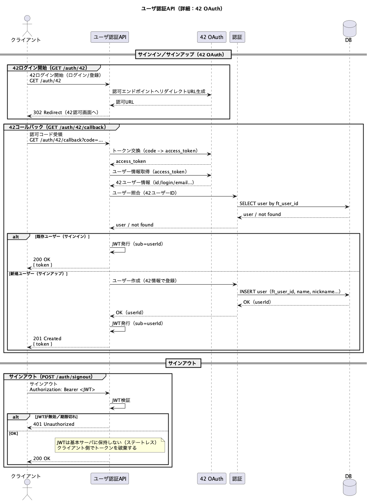

# ユーザ認証API（42 OAuth）



---
## 概要
```txt
42 OAuth を利用したユーザ認証に関するAPI。

42アカウントによるログインを通じてユーザーを認証し、  
認証成功後は本サービス用のJWTを発行する。
```

<br>

## 機能
#### ユーザ認証
- [42ログインを開始するもの](#42ログインを開始するもの)
- [42コールバックを受け取るもの](#42コールバックを受け取るもの)
- [サインアウトするもの](#サインアウトするもの)

<br>

## 詳細

### 42ログインを開始するもの
**メソッド : GET**  <br>
**エンドポイント : /auth/42** <br>
<br>

**概要**  
42 OAuth を用いたログイン／サインアップ処理を開始する。  
42の認可画面へリダイレクトする。

**認証**  
なし

**引数**  
なし

**戻り値**

|番号|型|説明|
|:--|:--|:--|
|01|Redirect|42の認可画面へのリダイレクト|

---

### 42コールバックを受け取るもの
**メソッド : GET**  
**エンドポイント : /auth/42/callback**

**概要**  
42 OAuth 認可後に呼び出されるコールバックAPI。  
受け取った認可コードを用いて42と通信し、ユーザーを特定する。

- 既存ユーザーの場合：サインイン  
- 新規ユーザーの場合：サインアップ  

認証完了後、本サービス用のJWTを発行する。

**認証**  
なし（42 OAuth による認可結果を利用）

**引数**

|番号|名称|型|説明|
|:--|:--|:--|:--|
|01|code|string|42から返却される認可コード|

**戻り値**

|番号|型|説明|
|:--|:--|:--|
|01|string|JWT|

**レスポンス例**

{  
&nbsp;&nbsp;"token": "eyJhbGciOiJIUzI1NiIsInR5cCI6IkpXVCJ9..."  
}

---

### サインアウトするもの
**メソッド : POST**  
**エンドポイント : /auth/signout**

**概要**  
ログイン中ユーザーをサインアウトする。  
JWTはサーバ側で保持しないため、クライアント側でJWTを破棄する。

**認証**  
Authorizationヘッダに JWT を指定する。  

Authorization: Bearer <JWT>

**引数**  
なし

**戻り値**

|番号|型|説明|
|:--|:--|:--|
|01|string|結果メッセージ|

**レスポンス例**

{  
&nbsp;&nbsp;"message": "signed out"  
}

---

## 補足
- 本APIは 42 OAuth を用いた認証専用APIである  
- JWTはステートレスであり、サーバ側では保持しない  
- ユーザー識別には 42 のユーザーID（ft_user_id）を使用する  
